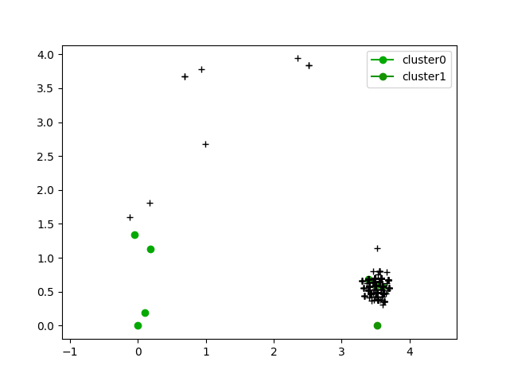
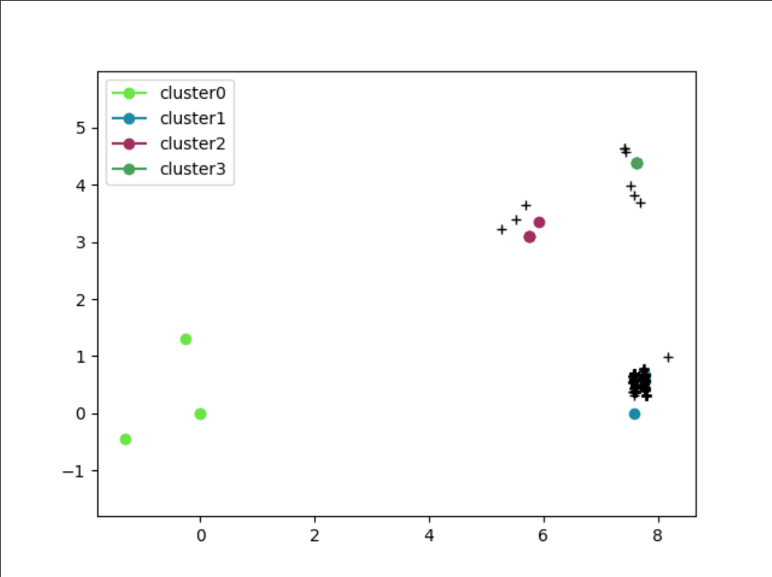

# clustering-fingerprinting

## Option descriptions
**-h** : Display the help 

**--format** : precise the format of the input files after this flag (pcap or fingerprint)

**--files** : add the fingerprint files to analyze after this flag

**--clusters** : number of cluster to create (this option or --threshold needs to be set)

**--mode**: type int.
    default = 2,
    choices = [0, 1, 2, 3, 4].
    "0 - similar number of collisions and fingerprints as mode 2, but using fewer features, "
    "1 - representation of all designed features, but a little more collisions than modes 0, 2, and 4, "
    "2 - optimal (the default mode), "
    "3 - the lowest number of generated fingerprints, but the highest number of collisions, "
    "4 - the highest fingerprint entropy, but slightly more fingerprints than modes 0-2",

**--threshold** : maximum distance inside a cluster

**--distance-algorithm** : select a distance type between ( _sequencematcher_(default), _levenstein_, _jaro_)
    
**--stats** : print the output in the terminal with full verbosity

**--json** : output to json to be reused

**--graph** : Graphical output. The known malicious files must be specified with the --files options, they will be the reference clusters. A file to analyze compared to this reference clusters can be specified after the --grap flag.

## Global descriptions
Several steps are required in order to anaylze a pcap file containing HTTP requests.


**Create clusters from several pcap files**

In order to compare pcap you can use the --format pcap option, to compare file of fingerprints you can use the --format fingerprint option.**The program will automatically extract the HTTP fingerprints from the pcap and remove the duplicated ones when the fingerprint file is given to the clustering program.**


The goal is to create clusters from those files, you can add directly files with the --files flag. Then the --stats flag to get the printed results with many details. Finaly you need to set the -t (threshold) or -c (cluster),the cluster option indicates how many cluster you want, the threshold option indicates the size of the clusters to create. **Careful, on and exactly one of the options -t and -c must be specified in order to work.** 


**Determine if a pcap contains malicious requests.**

There are several ways to determine if a pcap is malicious or not. First you can use the method described above, create clusters based on a threshold and see if some requests of the analyzed pcap are in the same cluster than known malicious requests. (First usage exemple) 

The other way is to do it graphicaly using the graphical module with the --graph option. 


## Usage example
The following line is running the program asking for a stat output (all the clusters with the file from the fingerprints and their numbers), the files to analyze are given after the _--files_ flag, so it is fingerprints files, with the following format:


The clusters are set to have a maximum distance of 3. 
> python3 main.py --format fingerprint --files fingerprints/xss fingerprints/sqlmap fingerprints/maliciousUser fingerprints/burp_bruteforce fingerprints/legitime -t 3 --stats


The following line display a graphic view of the clusters, comparing the file maliciousUser.
>python3 main.py --stats --format fingerprint --files fingerprints/legitime fingerprints/sqlmap fingerprints/xss --clusters 2 --graph fingerprints/maliciousUser



The following line asks for a json output. The Json file can then be used as a reference of malicious request in order to be compared to unknown pcap files. 
> python3 main.py --format fingerprint --files fingerprints/xss pcap/xxe fingerprints/ffuf fingerprints/sqlmap fingerprints/nmapScriptMethods fingerprints/burp_bruteforce -j superJson.json -t 3


## How does it works ? 

We modified the hfinger library to create fingerprint from HTTP requests and convert PCAP files to text files containing fingerprints. 

The difflib and jellyfish libraries are used to calculate distances between two fingerprints. 

The AgglomerativeClustering function from the sklearn.cluster library is used to create the clusters. 

## Development

- clustering
    - [x] Manage pcap and fingerprint files
    - [x] Create clusters from fingerprint files and print an output with statistic details of the clusters
    - [x] Change the distance type using a flag
    - [ ] Real time clustering 
- output
    - [x] Propose a Json output to avoid the recalculation of the clusters
    - [x] Propose a statistic output to give details about the created clusters ( more details could be added but the output might be unreadable)
    - [x] Propose a graphical output with a graph showing the comparision between the analyzed file and the reference clusters. 
    

# Graph display
This part is built to get a graphical representation of fingerprints. It takes in parameter a JSON reference to place clusters, and another JSON array or arrays to place fingerprints. 

The goal is to give an idea of distances between every fingerprint given.

The first JSON place points for each cluster with a random color as a reference, the second JSON represent the fingerprints generated by a user and represented as black crosses. The last one is the actual evaluated result of the navigation of a user. 



### How it works
No library is used but maths. The first ever fingerprint _A_ is given the coordinates {0,0} as a base, the second fingerprint _B_ is given the distance between these two points {?, 0}.

To place a _C_ point, this one will need to contain both distances to _A_ and _B_. Roughly, trying to place C with _AC_ and _BC_ distances, the point can only be at top or bottom from the horizontal _AB_. 
In this code, _C_ will always be on top. Each point follow the same process.

```
{cx, cy}

cx^2+cy^2==ac^2 && (cx-ab)^2+cy^2==bc^2

=> cx^2-(cx-ab)^2==ac^2-bc^2
=> 2*cx*ab==ac^2-bc^2+ab^2

=> cx = (ac^2-bc^2+ab^2)/(2*ab)

=> cy = +/- sqrt(ac^2-cx^2)   iff ac^2-cx^2 > 0
=> cy = 0   iff ac^2-cx^2 = 0
=> else no solution
```

### Usage example
> display/doGraph.py -f superJson.json -p listPoints.json

### GIF
You may clone the _GIF_ Github branch in order to generate a moving graph. For each user fingerprint (black cross) an image is generated. They will eventually be added to form a queue and generate a GIF.


Note that this process takes ages to run and could be improved.

# Entry points
## Hfinger

Research were made on how hfinger process pcap, functions were used one by one to decompose behavior :

1. Init logger
2. Parse args
3. Run tshark and output to json
4. Fix tmp json if needed
5. Read json > format keys
6. Call functions to hash infos
7. Return a whole line

### Development

- pcap fingerprinting
    - [ ] Multithread 
    - [x] Handle errors and pursue process
- json entry
    - [x] Check legitimacy of entry first
    - [x] Read needed keys
    - [x] Format for usability
    - [x] Process

### Usage example
> hfingerprinter.py -f files/onlyhttp.pcap -ot out -l test

> sortfingerprint.py files/legitimeFirefox files/legitimeFirefox2 files/wannaCry
