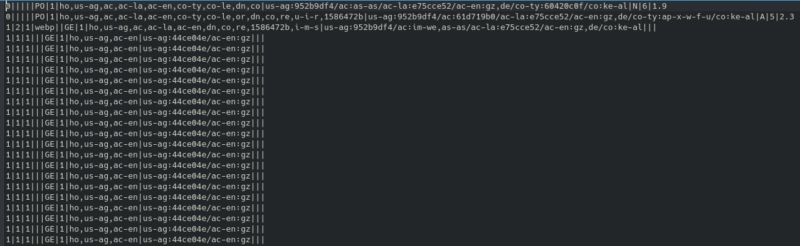
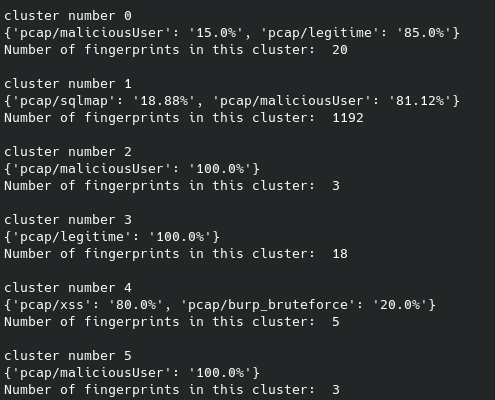

Classification des empreintes générées par hfinger grâce à l'algorithme KMeans de la librairie scikit-learn en python
# clustering-fingerprinting

## Option descriptions
**-h** : Display the help 

**--files** : add the fingerprint files to analyze after this flag

**--pcap** : add the pcap files to be analyzed.

**--stats** : print the output in the terminal with full verbosity

**--clusters** : number of cluster to create (this option or --threshold needs to be set)

**--threshold** : maximum distance inside a cluster

**--json** : output to json to be reused

**--distance-algorithm** : select a distance type between ( _sequencematcher_(default), _levenstein_, _jaro_)

## Global descriptions
Several steps are required in order to anaylze a pcap file containing HTTP requests.

**Create clusters from several pcap files**

In order to compare several pcap files you need at first to convert those files into text files containing the HTTP fingerprints. This operation can be done using the --pcap flag.**The program will automatically remove the duplicated fingerprints when the fingerprint file is given to the clustering program.**

Then it is possible to create clusters from those files, you can add the file containing the fingerprints with the --files flag. Then the --stats flag to get the printed results with many details. Finaly you need to set the -t (threshold) or -c (cluster),the cluster option indicates how many cluster you want, the threshold option indicates the size of the clusters to create. **Careful, on and exactly one of the options -t and -c must be specified in order to work.** 

**Determine if a pcap contains malicious requests.**

There are several ways to determine if a pcap is malicious or not. First you can use the method described above, create clusters based on a threshold and see if some requests of the analyzed pcap are in the same cluster than known malicious requests. (First usage exemple) 

The other way is to do it graphicaly using the graphical module. 

## Usage example
The following line is running the program asking for a stat output (all the clusters with the file from the fingerprints and their numbers), the files to analyze are given after the _--files_ flag, so it is fingerprints files, with the following format:

The clusters are set to have a maximum distance of 3. 
> python3 main.py --files pcap/xss pcap/sqlmap pcap/maliciousUser pcap/burp_bruteforce pcap/legitime -t 3 --stats

The following line asks for a json output. The Json file can then be used as a reference of malicious request in order to be compared to unknown pcap files. 
> python3 main.py --files pcap/xss pcap/xxe pcap/ffuf pcap/sqlmap pcap/nmapScriptMethods pcap/burp_bruteforce -j superJson.json -t 3

## Development

- clustering
    - [x] Convert pcap to txt file containing fingerprints. 
    - [x] Create clusters from fingerprint files.
    - [ ] Real time clustering 
- output
    - [x] Propose a Json output to avoid the recalculation of the clusters
